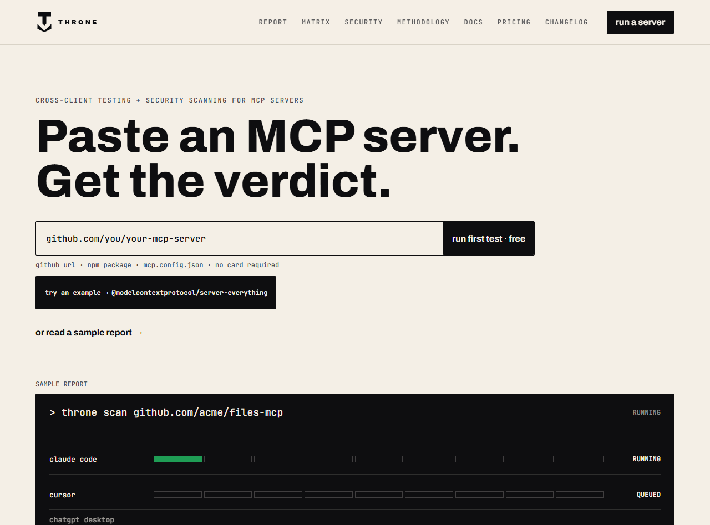

# Throne MCP Gate

[English](README.md) · [简体中文](README.zh-CN.md) · **Русский** · [हिन्दी](README.hi.md) · [日本語](README.ja.md) · [한국어](README.ko.md) · [Deutsch](README.de.md)

[](https://github.com/marketplace/actions/throne-mcp-gate)
[](https://github.com/usethrone/throne-ci/actions/workflows/test.yml)
[](LICENSE)

<p align="center">
  <a href="https://usethrone.dev"></a>
</p>

> Это перевод. Источник истины — английский [README](README.md).

**Перестаньте выпускать MCP-серверы, которые ломаются у реальных клиентов.** Этот Action запускает ваш сервер в одноразовой microVM, повторяет девять шагов протокола по поведению клиентов, откалиброванному на реальном трафике Claude Code и Cursor, сканирует исходный код на проблемы безопасности и проваливает сборку, когда вердикт ухудшается.

Каждый запуск ссылается на публичную запись-доказательство. Ничего не утверждается без запуска, который это доказал.

```yaml
- uses: usethrone/throne-ci@v1
  with:
    target: "@your-scope/your-mcp-server"
    api-key: ${{ secrets.THRONE_API_KEY }}
```

## Зачем

Любой каталог MCP — это список заявленных самими авторами записей. Никто не запускает серверы. Throne запускает: свежая Firecracker microVM на каждое сканирование, установка из npm, PyPI или GitHub, запуск через stdio и уничтожение после. В результате вы получаете вердикт, на котором можно строить блокировку merge, подкреплённый доказательствами, которые может прочитать каждый.

## Быстрый старт

Проверяйте каждый pull request и публикуйте вердикт комментарием:

```yaml
name: throne-gate
on:
  pull_request:

permissions:
  contents: read
  pull-requests: write   # позволяет Action оставлять комментарий с вердиктом

jobs:
  gate:
    runs-on: ubuntu-latest
    steps:
      - uses: usethrone/throne-ci@v1
        with:
          target: "@your-scope/your-mcp-server"   # или "uvx your-package" / https://github.com/you/repo
          api-key: ${{ secrets.THRONE_API_KEY }}
```

Уберите блок `permissions`, если комментарии в PR не нужны, или задайте `comment-on-pr: false`.

## Входные параметры

| параметр | обязателен | по умолчанию | значение |
|---|---|---|---|
| `target` | да | | npm-пакет (`@scope/name` или `name`), `uvx <pypi-name>` или `https://github.com/owner/repo` |
| `api-key` | да | | ваш API-ключ Throne. Храните его в secrets репозитория |
| `fail-on` | нет | `not_fit` | вердикты, блокирующие merge, через запятую. Добавьте `inconclusive` для строгого режима |
| `fail-on-security` | нет | `off` | позволяет сканированию безопасности тоже блокировать merge: `review` блокирует при любой находке, `high` — только при находке высокой серьёзности, `off` не блокирует никогда |
| `comment-on-pr` | нет | `true` | публиковать закреплённый комментарий с вердиктом в PR (нужен `pull-requests: write`) |
| `github-token` | нет | `${{ github.token }}` | токен для комментария в PR |
| `api-base` | нет | `https://api.usethrone.dev` | переопределяйте только для self-hosted или тестов |
| `timeout-seconds` | нет | `600` | сколько секунд ждать завершения сканирования |

## Выходные параметры

| выход | значение |
|---|---|
| `verdict` | `fit`, `not_fit`, `inconclusive` или `unknown` |
| `reason` | при inconclusive: `needs_credentials`, `needs_arguments`, `needs_environment`, `unsupported_layout`, `install_timeout`, `no_handshake` или `launch_error` |
| `security-verdict` | `clean`, `review` или `not_run` |
| `security-findings` | общее число находок безопасности (`0`, когда чисто или не запускалось) |
| `security-high` | число находок безопасности высокой серьёзности |
| `scan-id` | сканирование, на котором основан вердикт |
| `record-url` | публичная запись-доказательство |
| `summary` | вердикт в одну строку |

Выходные параметры остаются определёнными, даже если гейт упал: если скан завершился ошибкой, истёк по таймауту или был отклонён, шаг, читающий их под `if: always()`, увидит `verdict: unknown` и `security-verdict: not_run`, а не пустые строки.

## Что означает вердикт

- **fit** — полная совместимость с протоколом на обоих профилях клиентов. Можно выпускать.
- **not_fit** — реальный сбой протокола. Единственный вердикт, который блокирует merge по умолчанию.
- **inconclusive** — сервер запустился, но его не удалось полностью оценить. Причину указывает `reason`. Чаще всего это `needs_credentials`: сервер устанавливается и стартует корректно, а затем завершает работу, требуя API-ключ. Обычно это нормально, поэтому `inconclusive` **не** блокирует merge, пока вы не добавите его в `fail-on`.

Находки безопасности — это отдельная ось. Вердикт безопасности `review` — это материал для человека; он никогда не меняет вердикт совместимости и сам по себе не блокирует merge.

## Строгий режим

Чтобы блокировать ещё и когда сервер не удалось оценить:

```yaml
        with:
          target: "@your-scope/your-mcp-server"
          api-key: ${{ secrets.THRONE_API_KEY }}
          fail-on: "not_fit,inconclusive"
```

## Проверяемость

Это composite action. Весь гейт — это один читаемый shell-скрипт [`throne-gate.sh`](./throne-gate.sh): без скомпилированных бинарников, без собранного JavaScript, без транзитивных зависимостей. Для инструмента, который вы ставите в путь релиза, вы должны иметь возможность прочитать каждую выполняемую строку. Здесь это так.

## Как получить ключ

Throne набирает небольшую группу founding design partners. Запросите ключ по адресу **hello@usethrone.dev** или подайте заявку на [usethrone.dev/pricing](https://usethrone.dev/pricing). Для бесплатного сканирования на [usethrone.dev](https://usethrone.dev) ключ не нужен.

## Носите корону

Если ваш сервер получил вердикт `fit`, его запись-доказательство предлагает живой README-бейдж, который обновляется по последнему сканированию. Если релиз когда-нибудь сломает вердикт, бейдж сам это покажет.

## Лицензия

MIT. См. [LICENSE](./LICENSE).
